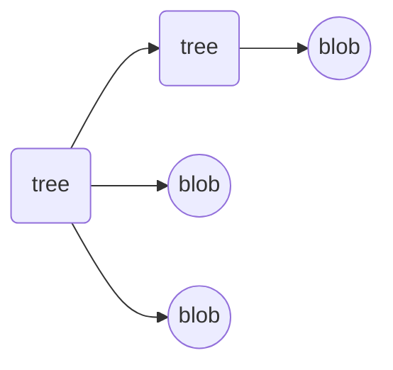
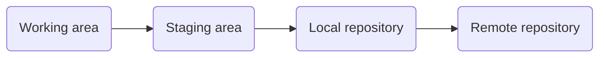

# Introdução ao Git e GitHub

### Entendendo como o Git Funciona por baixo dos panos:
**Sha1 (Secure Hash Algorithm)**
* É uma forma curta de representar um arquivo
*  Consiste em um conjunto de Funções Hash criptograficas projetadas pela Agência Nacional dos EUA
* A encriptação gera um conjunto de caracteres de 40 digitos

### Objetos internos do Git:

### Objetos internos do git
* **Blobs:**
Local onde é guardado o SHA e metadados (tamanho do arquivo, tipo do arquivo etc)
* **Tree:**
Armazena blobs e aponta para o diretório, além de possuir um SHA próprio
* **Commit:**
Aponta para a tree, úlyimo commit realizado, autor, mensagem e timestamp. Possui SHA próprio

###  Principais comandos com Git:
* **Iniciar git:** git init
* **Mover arquivos:** git add .
* **Add commit:** git commit -m "nome do commit"
* **Reposit´rio GitHub:** git romote add origin **link SSH/https**
* **Add no repositório:** git push origin main

###  Ciclo de vida dos arquivos Git:

###  Outros comandos com Git:
* **como está o repositório:** git status
* **clonar um repositório remoto:** git clone ~~link~~
* **verificar nome e email cadastrado:** git config --list